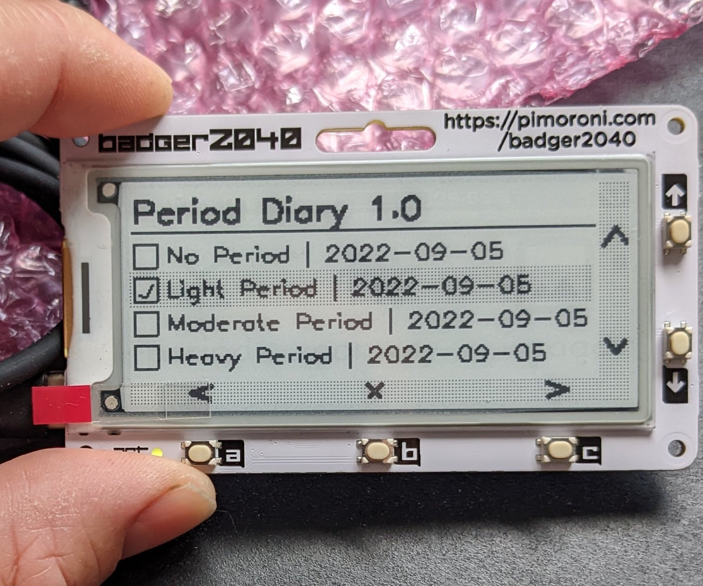
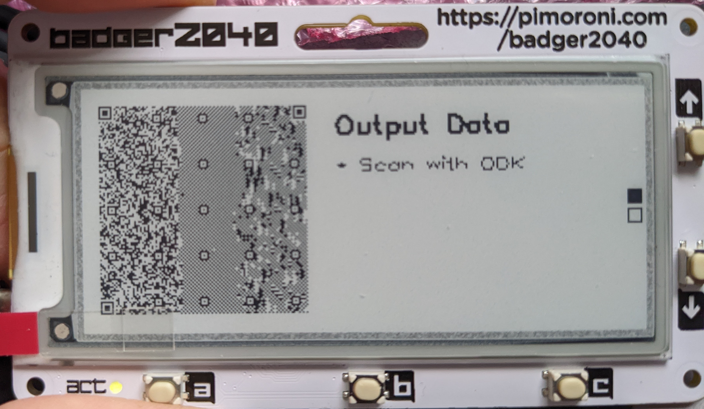

# Badger 2040 for Public Health

## About this project

The Badger 2040 is a really neat device that puts a programmable python-based OS on to a credit-card sized device that comes complete with some buttons (essentially a D pad + enter) and a small e-ink screen. 

At the moment, this is an early prototype of the concept, which we hope to develop further in the near future. 

Key features are

* This can be used as a data entry or health records device for research and clinical trials.
* It's modifiable, so adding sensors, clocks etc is possible
* It has a proper screen, so you can make things interactive
* As an extreme low-power solution, the device has a lot of potential for use in settings where there's limited or no power grid.

## Our aim

With this project, we're trying to figure out what we can do with Badger 2040 in public health settings. 

### About the code

At the moment this is a quick and dirty fork of the excellent things you'll find here
[https://github.com/pimoroni/pimoroni-pico](https://github.com/pimoroni/pimoroni-pico)

### Examples

* Our first test is a pretty simple electronic diary, intended to collect daily data about menstruation health.

* 	Check it out by looking at [Working_Drafts/period.py](Working_Drafts/period.py)

The functionality here is really basic. The data entry uses the buttons to navigate across the dates, with each page presenting a separate date.

Each day, the participant will fill in the form and as they select and deselect boxes the data are saved in the background to a text file on the device's flash memory. 

When field team want to take a copy of the data, a separate 'app' [Working_Drafts/QRtransfer.py](Working_Drafts/QRtransfer.py) converts the contents of the text file to a QR code. [ODK](https://github.com/getodk) or similar electronic data management system can then be used to copy the data on to a structured database.

*  Obvs it helps if you have a Badger 2040. Buy them [here](https://shop.pimoroni.com/products/badger-2040?variant=39752959852627).

